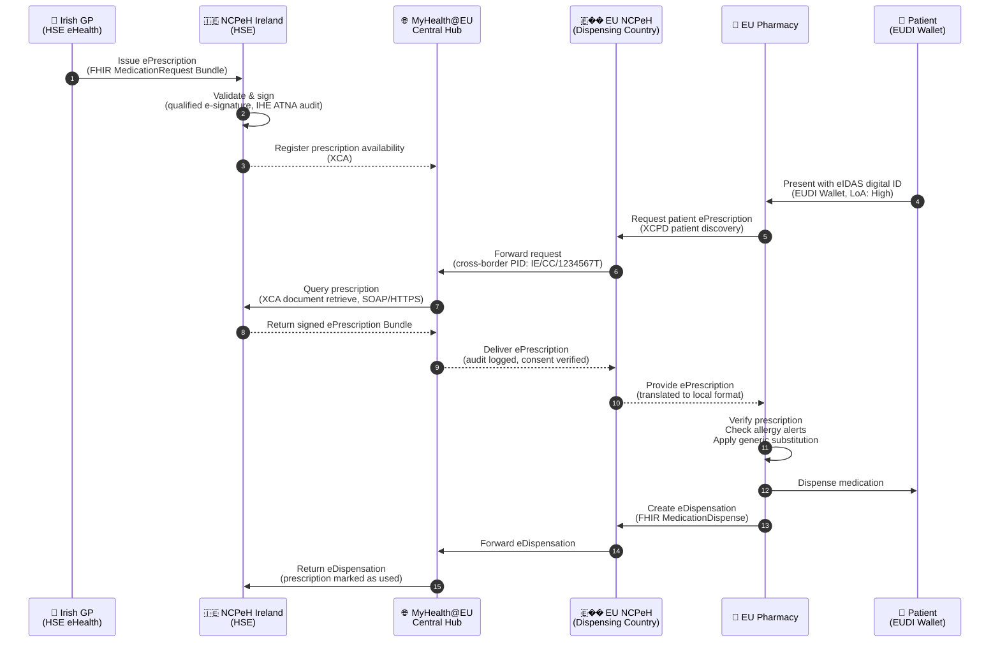
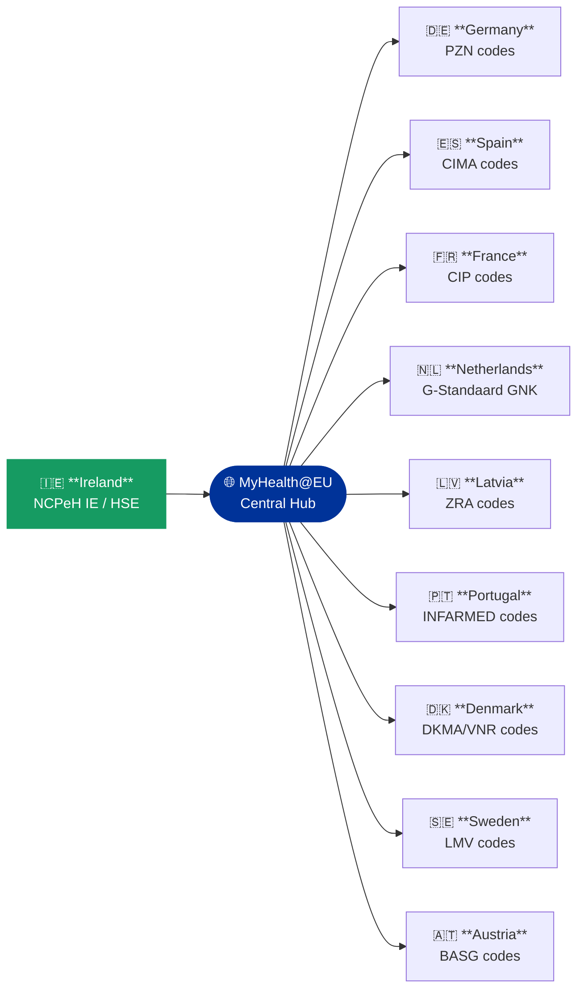

### Cross-Border ePrescription (MyHealth@EU)

This section covers Ireland's participation in the EU cross-border ePrescription and eDispensation infrastructure under [MyHealth@EU](https://health.ec.europa.eu/ehealth-digital-health-and-care/electronic-cross-border-health-services_en) and the [European Health Data Space (EHDS)](https://health.ec.europa.eu/ehds) Regulation 2025/327.

IE Core provides dedicated FHIR R4 profiles for the full ePrescription lifecycle — from prescription creation in Ireland through cross-border transmission and foreign dispensation, to the eDispensation response returned to the Irish National Contact Point for eHealth (NCPeH).

---

### What This Section Covers

| Page | Description |
|------|-------------|
| [Patient Profile & Scenarios](crossborder-patient-profile.html) | Reference patient Seán Murphy, all 11 cross-border scenarios, eIDAS identifiers, workflow diagrams, drug code system mapping by country |
| [Sample Payloads & Downloads](crossborder-sample-payloads.html) | All FHIR Bundle JSON, CDA XML, and IPS examples with descriptions, download links, and API testing commands |

---

### Scope

#### Outbound (Ireland → EU)

An Irish GP issues a prescription using IE Core ePrescription profiles. The prescription is transmitted via the Irish NCPeH (HSE eHealth) through the MyHealth@EU Central Hub to the destination country's NCPeH, where a foreign pharmacy can retrieve and dispense it.

Nine destination countries are illustrated in this guide:

| # | Destination | Drug Code System | Medications |
|---|-------------|-----------------|-------------|
| 1 | 🇩🇪 Germany | PZN (Pharmazentralnummer) | Metformin + Lisinopril |
| 2 | 🇪🇸 Spain | CIMA (Agencia Española) | Metformin + Lisinopril + Atorvastatin |
| 3 | 🇫🇷 France | CIP (ANSM) | Metformin + Lisinopril |
| 4 | 🇳🇱 Netherlands | G-Standaard GNK | Metformin + Lisinopril + Atorvastatin |
| 5 | 🇱🇻 Latvia | ZRA (Zāļu reģistrs) | Metformin + Lisinopril |
| 6 | 🇵🇹 Portugal | INFARMED | Sertraline + Omeprazole |
| 7 | 🇩🇰 Denmark | DKMA/VNR | Warfarin 5mg |
| 8 | 🇸🇪 Sweden | LMV (Läkemedelsverket) | Insulin Glargine + Insulin Aspart |
| 9 | 🇦🇹 Austria | BASG | Atorvastatin 80mg + Ramipril 10mg |

#### Inbound (EU → Ireland via NePS)

EU citizens visiting Ireland can have their foreign prescriptions dispensed at Irish pharmacies through the National ePrescription Service (NePS). Foreign drug codes are mapped to Irish NMPC codes, with SNOMED CT Irish Edition carried as secondary coding where available.

| # | Origin | Patient | Irish Pharmacy |
|---|--------|---------|----------------|
| 10 | 🇫🇮 Finland | Mikko Korhonen | Hickey's Pharmacy, O'Connell Street, Dublin |
| 11 | 🇧🇪 Belgium | Lars Janssen | McCauley's Pharmacy, Grafton Street, Dublin |

---

### Technical Infrastructure

The following sequence diagram shows the full cross-border ePrescription workflow from prescription creation in Ireland through dispensation in an EU member state and return of the eDispensation record.

#### Cross-Border Routing Overview

The diagram below shows how Ireland routes outbound ePrescriptions to nine EU destination countries through the MyHealth@EU Central Hub, each using the destination country's national drug code system.

### IHE Profiles Used

| IHE Profile | Purpose | Protocol |
|-------------|---------|---------|
| XCPD (Cross-Community Patient Discovery) | Find patient in home country | SOAP/HTTPS |
| XCA (Cross-Community Access) | Retrieve ePrescription document | SOAP/HTTPS |
| MHD (Mobile access to Health Documents) | FHIR-based document exchange | REST/HTTPS |
| ATNA (Audit Trail and Node Authentication) | Security audit logging | Syslog/TLS |
| IUA (Internet User Authorization) | OAuth2/SMART on FHIR | OAuth2 |

### FHIR Profiles Used

| Scenario | IE Core Profile |
|----------|----------------|
| Patient identity | [IE Core Patient](StructureDefinition-ie-core-patient.html) |
| GP / Prescriber | [IE Core Practitioner](StructureDefinition-ie-core-practitioner.html) |
| Allergy alert | [IE Core AllergyIntolerance](StructureDefinition-ie-core-allergyintolerance.html) |
| ePrescription | [IE Core MedicationRequest (ePrescription)](StructureDefinition-ie-core-medicationrequest-eprescription.html) |
| eDispensation | [IE Core MedicationDispense (eDispensation)](StructureDefinition-ie-core-medicationdispense-edispensation.html) |
| Medication | [IE Core Medication (ePrescription)](StructureDefinition-ie-core-medication-eprescription.html) |
| Patient Summary | [IE Core Patient Summary](StructureDefinition-ie-core-composition-patient-summary.html) |

### References

| Standard | URL |
|----------|-----|
| EHDS Regulation 2025/327 | <https://health.ec.europa.eu/ehds> |
| xt-EHR Project | <https://xt-ehr.eu> |
| MyHealth@EU | <https://health.ec.europa.eu/ehealth-digital-health-and-care/myhealtheu_en> |
| IPS FHIR IG | <http://hl7.org/fhir/uv/ips/> |
| EU MPD FHIR IG | <http://hl7.eu/fhir/mpd/> |
| eHDSI Technical Specs | <https://ehealth.ec.europa.eu/wiki/display/EHOPERATIONS> |
| eIDAS 2.0 | <https://digital-strategy.ec.europa.eu/en/policies/eidas-regulation> |
| IHE XCPD | <https://profiles.ihe.net/ITI/XCPD> |
| IHE XCA | <https://profiles.ihe.net/ITI/TF/Volume1/ch-18.html> |
| EDQM Standard Terms | <https://standardterms.edqm.eu> |
| ATC/DDD WHO | <https://www.whocc.no/atc_ddd_index/> |
