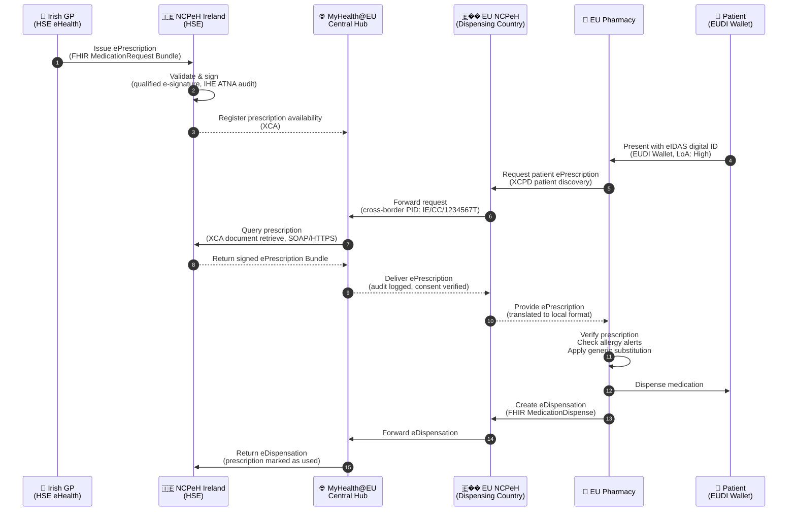
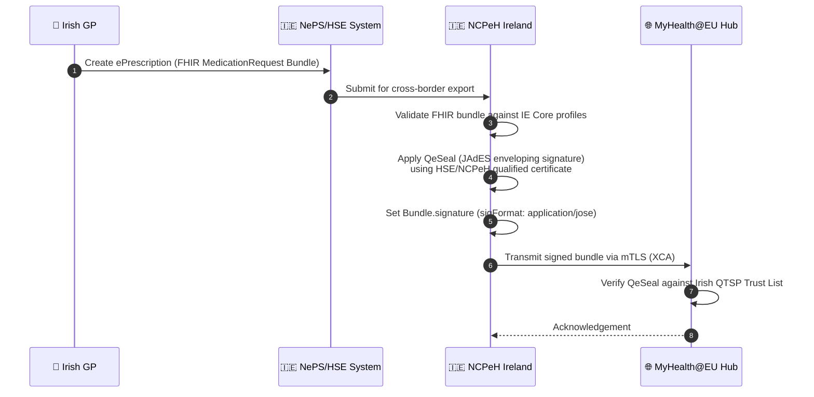

### Cross-Border ePrescription (MyHealth@EU)

This section covers Ireland's participation in the EU cross-border ePrescription and eDispensation infrastructure under [MyHealth@EU](https://health.ec.europa.eu/ehealth-digital-health-and-care/electronic-cross-border-health-services_en) and the [European Health Data Space (EHDS)](https://health.ec.europa.eu/ehds) Regulation 2025/327.

IE Core provides dedicated FHIR R4 profiles for the full ePrescription lifecycle — from prescription creation in Ireland through cross-border transmission and foreign dispensation, to the eDispensation response returned to the Irish National Contact Point for eHealth (NCPeH).

---

### What This Section Covers

| Page | Description |
|------|-------------|
| [Patient Profile & Scenarios](crossborder-patient-profile.html) | Reference patient Seán Murphy, all 11 cross-border scenarios, eIDAS identifiers, workflow diagrams, drug code system mapping by country |
| [Sample Payloads & Downloads](crossborder-sample-payloads.html) | All FHIR Bundle JSON, CDA XML, and IPS examples with descriptions, download links, and API testing commands |

---

### Scope

#### Outbound (Ireland → EU)

An Irish GP issues a prescription using IE Core ePrescription profiles. The prescription is transmitted via the Irish NCPeH (HSE eHealth) through the MyHealth@EU Central Hub to the destination country's NCPeH, where a foreign pharmacy can retrieve and dispense it.

Nine destination countries are illustrated in this guide:

| # | Destination | Drug Code System | Medications |
|---|-------------|-----------------|-------------|
| 1 | 🇩🇪 Germany | PZN (Pharmazentralnummer) | Metformin + Lisinopril |
| 2 | 🇪🇸 Spain | CIMA (Agencia Española) | Metformin + Lisinopril + Atorvastatin |
| 3 | 🇫🇷 France | CIP (ANSM) | Metformin + Lisinopril |
| 4 | 🇳🇱 Netherlands | G-Standaard GNK | Metformin + Lisinopril + Atorvastatin |
| 5 | 🇱🇻 Latvia | ZRA (Zāļu reģistrs) | Metformin + Lisinopril |
| 6 | 🇵🇹 Portugal | INFARMED | Sertraline + Omeprazole |
| 7 | 🇩🇰 Denmark | DKMA/VNR | Warfarin 5mg |
| 8 | 🇸🇪 Sweden | LMV (Läkemedelsverket) | Insulin Glargine + Insulin Aspart |
| 9 | 🇦🇹 Austria | BASG | Atorvastatin 80mg + Ramipril 10mg |

#### Inbound (EU → Ireland via NePS)

EU citizens visiting Ireland can have their foreign prescriptions dispensed at Irish pharmacies through the National ePrescription Service (NePS). Foreign drug codes are mapped to Irish NMPC codes, with SNOMED CT Irish Edition carried as secondary coding where available.

| # | Origin | Patient | Irish Pharmacy |
|---|--------|---------|----------------|
| 10 | 🇫🇮 Finland | Mikko Korhonen | Hickey's Pharmacy, O'Connell Street, Dublin |
| 11 | 🇧🇪 Belgium | Lars Janssen | McCauley's Pharmacy, Grafton Street, Dublin |

---

### Technical Infrastructure

The following sequence diagram shows the full cross-border ePrescription workflow from prescription creation in Ireland through dispensation in an EU member state and return of the eDispensation record.



#### Cross-Border Routing Overview

The diagram below shows how Ireland routes outbound ePrescriptions to nine EU destination countries through the MyHealth@EU Central Hub, each using the destination country's national drug code system.


### XT-EHR 1.0.0 ePrescription Model Changes

The XT-EHR **EHDSMedicationPrescription** logical model was updated in v1.0.0 with the following additions. IE Core ePrescription profiles have been updated to reflect these changes.

| XT-EHR 1.0.0 Addition | IE Core Element | Notes |
|-----------------------|-----------------|-------|
| `prescriptionItem.offLabel` | `MedicationRequest.extension[IECoreOffLabelUse]` | Boolean + optional reason; prescriber has knowingly prescribed outside approved indications |
| `prescriptionItem.statusReason` | `MedicationRequest.statusReason` | Reason for current prescription status (e.g., why cancelled or on hold) |
| `prescriptionItem.minimumDispenseInterval` | `MedicationRequest.dispenseRequest.dispenseInterval` | Minimum interval between dispensations for repeating prescriptions |
| `prescriptionItem.intendedUseType` | `MedicationRequest.category` | Categorisation of prescription intent (prophylaxis, treatment, anaesthesia, etc.) |

> **Off-label prescribing note**: The `IECoreOffLabelUse` extension is added at the `MedicationRequest` level. IE Core profiles for ePrescription, eDispensation, and Medication are formally derived from the EU MPD IG (`hl7.fhir.eu.mpd@1.0.0` STU, published Jun 2026). The extension contains two sub-extensions: `isOffLabelUse` (boolean, 1..1) and `reason` (CodeableConcept or string, 0..*).

> **R4/R5 note**: The XT-EHR logical models are authored in FHIR R5. In FHIR R4, `MedicationRequest.statusReason` and `dispenseRequest.dispenseInterval` are both available and map directly to the XT-EHR elements.

### IHE Profiles Used

| IHE Profile | Purpose | Protocol |
|-------------|---------|---------|
| XCPD (Cross-Community Patient Discovery) | Find patient in home country | SOAP/HTTPS |
| XCA (Cross-Community Access) | Retrieve ePrescription document | SOAP/HTTPS |
| MHD (Mobile access to Health Documents) | FHIR-based document exchange | REST/HTTPS |
| ATNA (Audit Trail and Node Authentication) | Security audit logging | Syslog/TLS |
| IUA (Internet User Authorization) | OAuth2/SMART on FHIR | OAuth2 |
| **DSG (Document Digital Signature)** | **Digital signing of prescription bundles** | **XAdES / JAdES** |

### FHIR Profiles Used

| Scenario | IE Core Profile |
|----------|----------------|
| Patient identity | [IE Core Patient](StructureDefinition-ie-core-patient.html) |
| GP / Prescriber | [IE Core Practitioner](StructureDefinition-ie-core-practitioner.html) |
| Allergy alert | [IE Core AllergyIntolerance](StructureDefinition-ie-core-allergyintolerance.html) |
| ePrescription | [IE Core MedicationRequest (ePrescription)](StructureDefinition-ie-core-medicationrequest-eprescription.html) |
| eDispensation | [IE Core MedicationDispense (eDispensation)](StructureDefinition-ie-core-medicationdispense-edispensation.html) |
| Medication | [IE Core Medication (ePrescription)](StructureDefinition-ie-core-medication-eprescription.html) |
| Patient Summary | [IE Core Patient Summary](StructureDefinition-ie-core-composition-patient-summary.html) |

---

### Cross-Border Security

This section describes the security requirements that apply specifically to cross-border ePrescription and eDispensation exchange via MyHealth@EU. For domestic security requirements, see the [Security](security.html) page.

#### eHDSI Security Framework

The eHealth Digital Service Infrastructure (eHDSI) Security Framework governs all cross-border healthcare data exchange. It is based on:

- **eHDSI Security and Privacy Architecture** (eHDSI-S-EP v2.2+) — defines security zones, trust hierarchies, and access control policies for all MyHealth@EU services
- **eIDAS Regulation 2014/910/EU** and **eIDAS 2.0 (Regulation 2024/1183/EU)** — electronic identification and qualified trust services
- **GDPR (2016/679/EU)** — data protection requirements applying to all cross-border health data exchange
- **EHDS Regulation (2025/327)** — data governance framework for primary and secondary use of health data

The eHDSI Security Framework defines three security domains:

| Domain | Description | Participants |
|--------|-------------|-------------|
| **National Domain** | Each Member State's internal health infrastructure | NCPeH, national health systems |
| **Central Infrastructure Domain** | MyHealth@EU Central Hub services | OpenNCP Central Connector, PMPOC |
| **Service Provider Domain** | Healthcare providers accessing NCP services | GPs, hospitals, pharmacies |

#### Prescription Bundle Signing

The Irish NCPeH **SHALL** apply a Qualified Electronic Seal to all outbound ePrescription bundles before transmission to the MyHealth@EU Central Hub.

**Signing process:**



**Signature elements in FHIR Bundle:**

| Element | Value | Notes |
|---------|-------|-------|
| `Bundle.signature.type` | `1.2.840.10065.1.12.1.7` (Consent Signature) or `1.2.840.10065.1.12.1.5` (Verification Signature) | HL7 Signature Type codes |
| `Bundle.signature.when` | ISO 8601 datetime | Signing time |
| `Bundle.signature.who` | Reference to NCPeH organization or prescribing practitioner | Signer identity |
| `Bundle.signature.sigFormat` | `application/jose` (JAdES) or `application/signature+xml` (XAdES) | Signature format |
| `Bundle.signature.data` | Base64-encoded JAdES/XAdES signature bytes | Actual signature |

#### mTLS for NCP-to-NCP Communications

All NCP-to-Hub and Hub-to-NCP communications **SHALL** use mutual TLS (mTLS):

| Parameter | Requirement |
|-----------|-------------|
| Protocol | TLS 1.3 (preferred) or TLS 1.2 (minimum) |
| Client certificate | Qualified certificate for electronic seal (QCSeal) — eIDAS Article 38 |
| Server certificate | Qualified website authentication certificate (QWAC) — eIDAS Article 45 |
| QTSP | Certificate issuer must be listed on the EU Trust Service Status List (EUTSL) |
| Key length | RSA 4096-bit or ECDSA P-384 minimum for QCSeal |
| Certificate pinning | NCP certificate fingerprints **SHOULD** be pinned in the Central Hub configuration |

#### Patient Identity Verification (eIDAS / EUDI Wallet)

When a patient presents at a foreign EU pharmacy to retrieve a cross-border prescription, the pharmacy **SHALL** verify the patient's identity using an eIDAS-compliant mechanism:

| Identity Mechanism | LoA | Acceptance |
|-------------------|-----|------------|
| EUDI Wallet (PID attestation) | High | **SHALL** be accepted from 2026 |
| National eID (eIDAS notified scheme) | High or Substantial | Accepted if LoA ≥ Substantial |
| EUDI Wallet (provisional / non-notified) | Substantial | Accepted during EUDI transition period |

The pharmacy system extracts the `personal_identifier` from the PID attestation (format: `Origin/Destination/NationalID`, e.g. `IE/DE/1234567T`) and submits this to the NCPeH for patient discovery (XCPD).

#### Cross-Border Consent Verification

Before a foreign NCPeH returns a prescription to the dispensing country, consent **SHALL** be verified:

1. **Implicit consent** — The patient presenting their EUDI Wallet / eIDAS identity at a pharmacy constitutes implicit consent for the pharmacy to retrieve their prescription, in accordance with the eHDSI consent model and EHDS Regulation 2025/327
2. **Explicit opt-out** — Patients may register an opt-out with their home country NCPeH to prevent cross-border data sharing
3. **Consent logging** — The consent decision (implicit/explicit, timestamp, patient identity, purpose of use) **SHALL** be logged as a FHIR `AuditEvent` at both the originating and receiving NCPs

Consent records **SHOULD** use the following `AuditEvent` structure:

```json
{
  "resourceType": "AuditEvent",
  "type": { "system": "http://dicom.nema.org/resources/ontology/DCM", "code": "110106", "display": "Export" },
  "action": "R",
  "recorded": "2025-01-20T10:30:00Z",
  "outcome": "0",
  "purposeOfEvent": [{ "system": "http://terminology.hl7.org/CodeSystem/v3-ActReason", "code": "TREAT", "display": "Treatment" }],
  "agent": [
    { "type": { "coding": [{ "code": "110150", "display": "Application" }] }, "who": { "display": "NCPeH Ireland (HSE)" }, "requestor": false },
    { "type": { "coding": [{ "code": "110153", "display": "Source Role ID" }] }, "who": { "identifier": { "system": "urn:oid:1.3.6.1.4.1.12559.11.10.1.3.1.42.1", "value": "IE/DE/1234567T" } }, "requestor": true }
  ],
  "source": { "site": "NCPeH-IE", "observer": { "display": "HSE NCPeH Ireland" } },
  "entity": [{ "what": { "reference": "Bundle/ie-bundle-to-de-eprescription" }, "role": { "code": "4", "display": "Domain Resource" } }]
}
```

---

### References

| Standard | URL |
|----------|-----|
| EHDS Regulation 2025/327 | <https://health.ec.europa.eu/ehds> |
| xt-EHR Project | <https://xt-ehr.eu> |
| MyHealth@EU | <https://health.ec.europa.eu/ehealth-digital-health-and-care/myhealtheu_en> |
| IPS FHIR IG | <http://hl7.org/fhir/uv/ips/> |
| EU MPD FHIR IG | <http://hl7.eu/fhir/mpd/> |
| eHDSI Technical Specs | <https://ehealth.ec.europa.eu/wiki/display/EHOPERATIONS> |
| eIDAS 2.0 (Regulation 2024/1183) | <https://eur-lex.europa.eu/legal-content/EN/TXT/?uri=CELEX:32024R1183> |
| EUDI ARF (Architecture & Reference Framework) | <https://digital-strategy.ec.europa.eu/en/policies/eudi-wallet-technical-specifications> |
| IHE XCPD | <https://profiles.ihe.net/ITI/XCPD> |
| IHE XCA | <https://profiles.ihe.net/ITI/TF/Volume1/ch-18.html> |
| IHE DSG | <https://profiles.ihe.net/ITI/TF/Volume1/ch-37.html> |
| ETSI eSignature (XAdES, JAdES, CAdES) | <https://www.etsi.org/technologies/electronic-signatures> |
| EDQM Standard Terms | <https://standardterms.edqm.eu> |
| ATC/DDD WHO | <https://www.whocc.no/atc_ddd_index/> |
