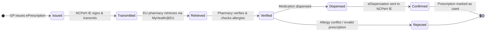
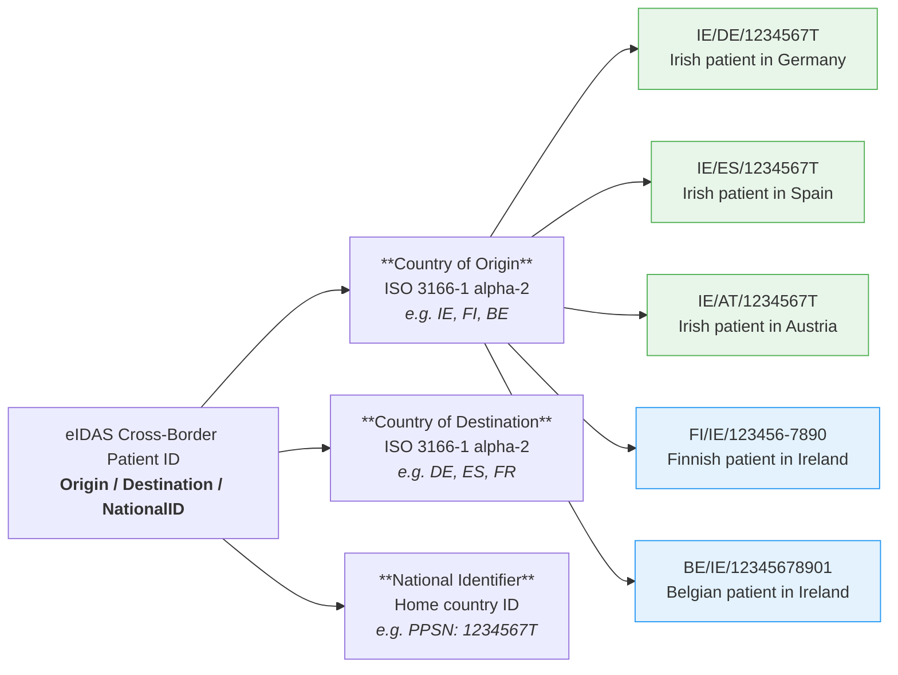
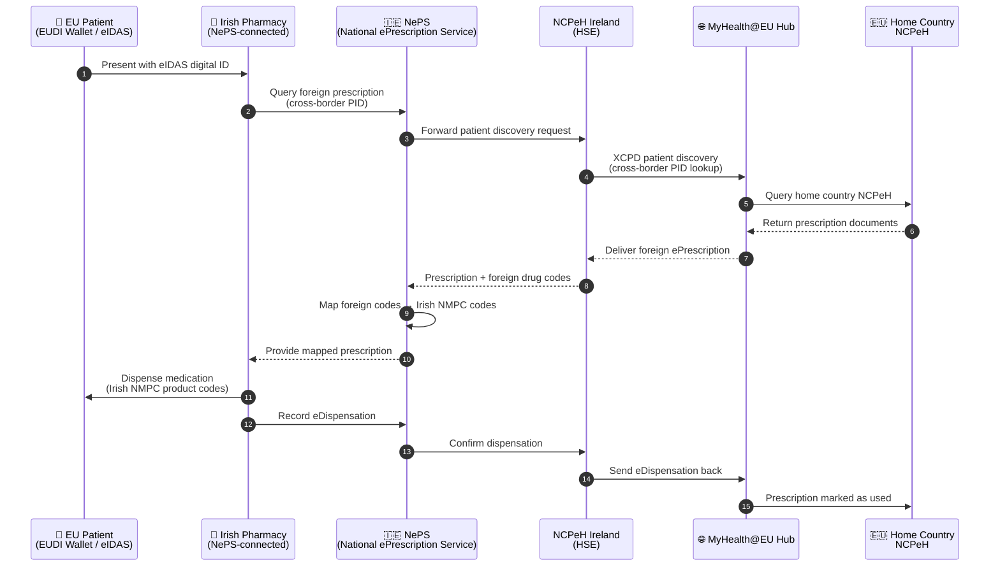

### Patient Profile — Seán Patrick Murphy

The following patient is used throughout all cross-border ePrescription examples in this guide. He represents a typical Irish patient with multiple chronic conditions travelling across the EU.

| Field | Value |
|-------|-------|
| **Name** | Seán Patrick Murphy |
| **DOB** | 15 March 1975 |
| **Gender** | Male |
| **Nationality** | Irish (IE) |
| **PPS Number** | 1234567T |
| **IHI** | 210000000099887766 |
| **eIDAS ID** | IE/[CountryCode]/1234567T |
| **Address** | 14 Grafton Street, Dublin 2, D02 XY45, Ireland |
| **GP** | Dr. Aoife O'Brien, Grafton Street Medical Practice |
| **GP Number** | GP-IE-12345 |

### ⚠️ Critical Allergy

> **Penicillin / Amoxicillin — ANAPHYLAXIS (Severe)**
>
> Documented 1995. Do **NOT** dispense penicillin-class antibiotics.
>
> This allergy alert is carried in all cross-border FHIR bundles as an `AllergyIntolerance` resource with `criticality: high` and `severity: severe`.

See: [AllergyIntolerance – Penicillin (Example)](AllergyIntolerance-ie-core-allergy-penicillin-murphy.html)

---

### Active Conditions

| Condition | ICD-10 | SNOMED CT | Active Since |
|-----------|--------|-----------|--------------|
| Type 2 Diabetes Mellitus | E11 | [44054006](https://browser.ihtsdotools.org/?perspective=full&conceptId1=44054006) | 2018 |
| Essential Hypertension | I10 | [38341003](https://browser.ihtsdotools.org/?perspective=full&conceptId1=38341003) | 2019 |
| Hypercholesterolaemia | E78.5 | [13644009](https://browser.ihtsdotools.org/?perspective=full&conceptId1=13644009) | 2020 |

See examples:
- [Condition – Type 2 Diabetes](Condition-ie-core-condition-t2dm-murphy.html)
- [Condition – Hypertension](Condition-ie-core-condition-hypertension-murphy.html)
- [Condition – Hypercholesterolaemia](Condition-ie-core-condition-hypercholesterolaemia-murphy.html)

---

### Current Medications

| Medication | Dose | Frequency | Indication | ATC |
|------------|------|-----------|------------|-----|
| Metformin 500mg | 500mg | Twice daily with meals | Type 2 Diabetes | A10BA02 |
| Lisinopril 10mg | 10mg | Once daily (morning) | Hypertension | C09AA03 |
| Atorvastatin 20mg | 20mg | Once daily (night) | Hypercholesterolaemia | C10AA05 |

Medication resources: [Lisinopril 10mg](Medication-ie-medication-lisinopril-10.html)
#### Prescription Lifecycle

---

### eIDAS Patient Identifier Format

Cross-border patient identification follows the [eIDAS Regulation](https://digital-strategy.ec.europa.eu/en/policies/eidas-regulation) format:

| Cross-Border Route | eIDAS Identifier |
|--------------------|-----------------|
| Ireland → Germany | `IE/DE/1234567T` |
| Ireland → Spain | `IE/ES/1234567T` |
| Ireland → France | `IE/FR/1234567T` |
| Ireland → Netherlands | `IE/NL/1234567T` |
| Ireland → Latvia | `IE/LV/1234567T` |
| Ireland → Portugal | `IE/PT/1234567T` |
| Ireland → Denmark | `IE/DK/1234567T` |
| Ireland → Sweden | `IE/SE/1234567T` |
| Ireland → Austria | `IE/AT/1234567T` |
| Finland → Ireland | `FI/IE/123456-7890` |
| Belgium → Ireland | `BE/IE/12345678901` |

---

### Cross-Border Scenarios

#### Outbound: Ireland → EU

---

#### Scenario 1: Ireland → Germany 🇩🇪

| Field | Value |
|-------|-------|
| **Date** | 20 January 2025 |
| **Pharmacy** | Apotheke am Brandenburger Tor, Pariser Platz 1, 10117 Berlin |
| **Medications dispensed** | Metformin 500mg + Lisinopril 10mg |
| **Format** | FHIR (xt-EHR) + CDA (eHDSI) |
| **Status** | ✅ Dispensed with generic substitution |
| **Validity rule** | 90 days (Arzneimittelgesetz §48) |

**German Product Mapping (PZN):**

| Irish Medication | German Equivalent | PZN Code |
|-----------------|-------------------|----------|
| Metformin 500mg | Metformin 500mg Filmtabletten (Ratiopharm) | 04823246 |
| Lisinopril 10mg | Lisinopril 10mg Tabletten (Hexal) | 03990693 |

FHIR Example: [IE→DE ePrescription Bundle](Bundle-ie-bundle-to-de-eprescription.html) ·
eDispensation: [DE eDispensation Response](Bundle-ie-bundle-de-edispensation-response.html)

---

#### Scenario 2: Ireland → Spain 🇪🇸

| Field | Value |
|-------|-------|
| **Date** | 10 February 2025 |
| **Pharmacy** | Farmàcia Central, Passeig de Gràcia 45, 08007 Barcelona |
| **Medications dispensed** | Metformin 500mg + Lisinopril 10mg + Atorvastatin 20mg |
| **Format** | FHIR (xt-EHR) |
| **Status** | ✅ All 3 medications dispensed |
| **Validity rule** | 90 days (Real Decreto 1718/2010) |

**Spanish Product Mapping (CIMA):**

| Irish Medication | Spanish Equivalent | CIMA Code |
|-----------------|-------------------|-----------|
| Metformin 500mg | Metformina Cinfa 500mg comprimidos | 60918 |
| Lisinopril 10mg | Lisinopril Kern Pharma 10mg comprimidos | 57552 |
| Atorvastatin 20mg | Atorvastatina Cinfa 20mg comprimidos | 72242 |

FHIR Example: [IE→ES ePrescription Bundle](Bundle-ie-bundle-to-es-eprescription.html)

---

#### Scenario 3: Ireland → France 🇫🇷

| Field | Value |
|-------|-------|
| **Date** | 5 March 2025 |
| **Pharmacy** | Pharmacie de la Madeleine, Place de la Madeleine, 75008 Paris |
| **Medications dispensed** | Metformin 500mg + Lisinopril 10mg |
| **Format** | FHIR (xt-EHR) |
| **Status** | ✅ Dispensed (ordonnance transfrontalière) |
| **Validity rule** | 3 months (Code de la Santé Publique) |

**French Product Mapping (CIP):**

| Irish Medication | French Equivalent | CIP Code |
|-----------------|-------------------|----------|
| Metformin 500mg | METFORMINE BIOGARAN 500mg comprimé pelliculé | 3402895 |
| Lisinopril 10mg | LISINOPRIL BIOGARAN 10mg comprimé | 3400936 |

FHIR Example: [IE→FR ePrescription Bundle](Bundle-ie-bundle-to-fr-eprescription.html)

---

#### Scenario 4: Ireland → Netherlands 🇳🇱

| Field | Value |
|-------|-------|
| **Date** | 1 April 2025 |
| **Pharmacy** | Apotheek Dam, Damrak 1, 1012 LG Amsterdam |
| **Medications dispensed** | Metformin 500mg + Lisinopril 10mg + Atorvastatin 20mg |
| **Format** | FHIR (xt-EHR) |
| **Status** | ✅ All 3 medications dispensed |
| **Validity rule** | 3 months (Geneesmiddelenwet) |

**Dutch Product Mapping (G-Standaard GNK):**

| Irish Medication | Dutch Equivalent | GNK Code |
|-----------------|-----------------|----------|
| Metformin 500mg | Metformine HCl 500mg tabletten | 1701410 |
| Lisinopril 10mg | Lisinopril 10mg tabletten | 1701420 |
| Atorvastatin 20mg | Atorvastatine 20mg tabletten | 1701430 |

FHIR Example: [IE→NL ePrescription Bundle](Bundle-ie-bundle-to-nl-eprescription.html)

---

#### Scenario 5: Ireland → Latvia 🇱🇻

| Field | Value |
|-------|-------|
| **Date** | 15 June 2025 |
| **Pharmacy** | Mēs atdot Aptieka, Riga |
| **Medications dispensed** | Metformin 500mg + Lisinopril 10mg |
| **Format** | FHIR (MPD) |
| **Status** | ✅ Dispensed |
| **Validity rule** | 90 days (LR Farmācijas likums) |

**Latvian Product Mapping (ZRA):**

| Irish Medication | Latvian Equivalent | ZRA Code |
|-----------------|-------------------|----------|
| Metformin 500mg | Metformins 500mg tabletes | ZRA-00098432 |
| Lisinopril 10mg | Lizinoprils 10mg tabletes | ZRA-00102345 |

FHIR Example: [IE→LV ePrescription Bundle](Bundle-ie-bundle-to-lv-eprescription.html) ·
eDispensation: [LV eDispensation](Bundle-lv-edispensation-response.html)

---

#### Scenario 6: Ireland → Portugal 🇵🇹

| Field | Value |
|-------|-------|
| **Date** | 20 June 2025 |
| **Pharmacy** | Farmácia Central, Lisbon |
| **Medications dispensed** | Sertraline 50mg + Omeprazole 20mg |
| **Format** | FHIR (MPD) |
| **Status** | ✅ Dispensed |
| **Validity rule** | 90 days (Portaria nº 298/2019) |
| **Substitution note** | Sertraline dispensed without substitution (psychiatric medication) |

**Portuguese Product Mapping (INFARMED):**

| Irish Medication | Portuguese Equivalent | INFARMED Code |
|-----------------|----------------------|---------------|
| Sertraline 50mg | Sertralina 50mg Comprimidos | INF-00012345 |
| Omeprazole 20mg | Omeprazol 20mg Cápsulas | INF-00056789 |

FHIR Example: [IE→PT ePrescription Bundle](Bundle-ie-bundle-to-pt-eprescription.html) ·
eDispensation: [PT eDispensation](Bundle-pt-edispensation-response.html)

---

#### Scenario 7: Ireland → Denmark 🇩🇰

| Field | Value |
|-------|-------|
| **Date** | 1 July 2025 |
| **Pharmacy** | Apoteket, Copenhagen |
| **Medications dispensed** | Warfarin 5mg |
| **Format** | FHIR (MPD) |
| **Status** | ✅ Dispensed with INR monitoring note |
| **Validity rule** | 90 days (Danish Medicines Agency) |
| **⚠️ Clinical note** | Anticoagulant — no substitution. INR target 2.0–3.0. Patient must contact local anticoagulation clinic. |

**Danish Product Mapping (DKMA/VNR):**

| Irish Medication | Danish Equivalent | VNR Code |
|-----------------|------------------|----------|
| Warfarin 5mg | Warfarin 5mg Tabletter | 00892628 |

FHIR Example: [IE→DK ePrescription Bundle](Bundle-ie-bundle-to-dk-eprescription.html)

---

#### Scenario 8: Ireland → Sweden 🇸🇪

| Field | Value |
|-------|-------|
| **Date** | 10 July 2025 |
| **Pharmacy** | Apoteket Hjärtat, Stockholm |
| **Medications dispensed** | Insulin Glargine 100u/ml + Insulin Aspart 100u/ml |
| **Format** | FHIR (MPD) |
| **Status** | ✅ Dispensed |
| **Validity rule** | 90 days (Läkemedelslag) |
| **Substitution note** | No substitution for insulin — dose continuity requires same brand |

**Swedish Product Mapping (LMV):**

| Irish Medication | Swedish Equivalent | LMV Code |
|-----------------|-------------------|----------|
| Insulin Glargine | Insulin Glargine 100 E/ml Injektionsvätska | SE-LMV-00892345 |
| Insulin Aspart | Insulin Aspart 100 E/ml Injektionsvätska | SE-LMV-00892346 |

FHIR Example: [IE→SE ePrescription Bundle](Bundle-ie-bundle-to-se-eprescription.html)

---

#### Scenario 9: Ireland → Austria 🇦🇹

| Field | Value |
|-------|-------|
| **Date** | 15 July 2025 |
| **Pharmacy** | Apotheke zur goldenen Kugel, Vienna |
| **Medications dispensed** | Atorvastatin 80mg + Ramipril 10mg |
| **Format** | FHIR (MPD) |
| **Status** | ✅ Dispensed |
| **Validity rule** | 90 days (Austrian Medicines Act) |

**Austrian Product Mapping (BASG):**

| Irish Medication | Austrian Equivalent | BASG Code |
|-----------------|--------------------|-----------| 
| Atorvastatin 80mg | Atorvastatin 80mg Filmtabletten | AT-BASG-0089234567 |
| Ramipril 10mg | Ramipril 10mg Filmtabletten | AT-BASG-0089234568 |

FHIR Example: [IE→AT ePrescription Bundle](Bundle-ie-bundle-to-at-eprescription.html)

---

#### Inbound Workflow: EU Patient → Ireland (via NePS)

The following sequence diagram shows how a foreign EU prescription is dispensed at an Irish pharmacy using the National ePrescription Service (NePS).

---

#### Scenario 10: Finland → Ireland 🇫🇮

| Field | Value |
|-------|-------|
| **Date** | 1 August 2025 |
| **Patient** | Mikko Korhonen (Finnish citizen, eIDAS: `FI/IE/123456-7890`) |
| **Irish Pharmacy** | Hickey's Pharmacy, O'Connell Street, Dublin |
| **Medications dispensed** | Metformin 500mg |
| **Format** | FHIR (MPD via NePS) |
| **Status** | ✅ Finnish prescription mapped through NePS |
| **Code mapping** | Finnish Kela code → Irish NMPC code (`NMPC-MET500TAB`) |

FHIR Example: [FI→IE Dispensation via NePS](Bundle-fi-to-ie-neps-dispensation.html)

---

#### Scenario 11: Belgium → Ireland 🇧🇪

| Field | Value |
|-------|-------|
| **Date** | 5 August 2025 |
| **Patient** | Lars Janssen (Belgian citizen, eIDAS: `BE/IE/12345678901`) |
| **Irish Pharmacy** | McCauley's Pharmacy, Grafton Street, Dublin |
| **Medications dispensed** | Atorvastatin 40mg |
| **Format** | FHIR (MPD via NePS) |
| **Status** | ✅ Belgian prescription mapped through NePS |
| **Code mapping** | Belgian CNPV code → Irish NMPC code (`NMPC-ATV40TAB`) |

FHIR Example: [BE→IE Dispensation via NePS](Bundle-be-to-ie-neps-dispensation.html)

---

### Drug Code Systems by Country

| Country | System | System URI | Example Code |
|---------|--------|------------|-------------|
| 🇮🇪 Ireland | NMPC + SNOMED CT Irish Edition + ATC | `https://hl7-ie.github.io/hl7-ie-fhir-draft-ig/fhir/ie/core/sid/nmpc` | NMPC-MET500TAB |
| 🇩🇪 Germany | PZN | `http://fhir.de/CodeSystem/ifa/pzn` | 04823246 |
| 🇪🇸 Spain | CIMA | `http://vocabularies.cesec.org/public-api/v1/codes/cima` | 60918 |
| 🇫🇷 France | CIP | `http://idref.fr/CIP` | 3402895 |
| 🇳🇱 Netherlands | G-Standaard GNK | `http://www.gipdatabank.nl/farmaca` | 1701410 |
| 🇱🇻 Latvia | ZRA | `http://www.zva.gov.lv/zalu-registrs` | ZRA-00098432 |
| 🇵🇹 Portugal | INFARMED | `http://www.infarmed.pt` | INF-00012345 |
| 🇩🇰 Denmark | DKMA/VNR | `http://www.dkma.dk` | 00892628 |
| 🇸🇪 Sweden | LMV | `http://www.lakemedelsverket.se` | SE-LMV-00892345 |
| 🇦🇹 Austria | BASG | `http://www.basg.gv.at` | AT-BASG-0089234567 |
| 🇧🇪 Belgium | CNPV | `http://www.cnpv.be` | BE-CNPV-XXXX |
| 🇫🇮 Finland | Kela/FIN | `http://www.kela.fi` | FIN-XXXX |
| 🇪🇺 EU (all) | ATC (WHO) | `http://www.whocc.no/atc` | A10BA02 |
| 🇪🇺 EU (all) | SNOMED CT | `http://snomed.info/sct` | 372567009 |

---

### Prescription Validity Rules by Country

| Country | Cross-Border Validity | Legal Basis |
|---------|-----------------------|-------------|
| 🇩🇪 Germany | 90 days from issue | Arzneimittelgesetz §48 |
| 🇪🇸 Spain | 90 days from issue | Real Decreto 1718/2010 |
| 🇫🇷 France | 3 months (ordonnance) | Code de la Santé Publique |
| 🇳🇱 Netherlands | 3 months | Geneesmiddelenwet |
| 🇱🇻 Latvia | 90 days | LR Farmācijas likums |
| 🇵🇹 Portugal | 90 days | Portaria nº 298/2019 |
| 🇩🇰 Denmark | 90 days | Danish Medicines Agency |
| 🇸🇪 Sweden | 90 days | Läkemedelslag |
| 🇦🇹 Austria | 90 days | Austrian Medicines Act |
| 🇪🇺 EU (eHDSI) | 90 days max | eHDSI Technical Specifications |
