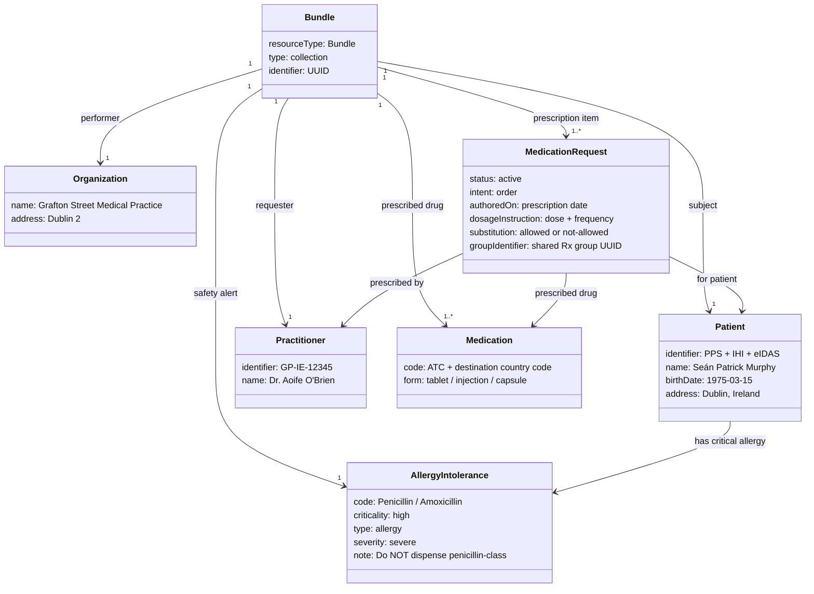

### Sample Payloads & Downloads

This page indexes all sample FHIR Bundle, FHIR IPS, and CDA document files provided in this Implementation Guide for the cross-border ePrescription workflow.

All FHIR examples are valid FHIR R4 Bundle resources that can be validated against IE Core profiles using the [FHIR Validator](https://confluence.hl7.org/display/FHIR/Using+the+FHIR+Validator) or tested against the FHIR Interoperability API.

---

### FHIR ePrescription Bundle Composition

Each outbound ePrescription Bundle contains the following FHIR resources. The `AllergyIntolerance` resource for the Penicillin allergy is always included so the dispensing pharmacy can perform automatic safety checks.



### FHIR Bundles — Outbound ePrescriptions (Ireland → EU)

These bundles represent Irish ePrescriptions transmitted via MyHealth@EU to foreign pharmacies. Each bundle includes the Patient, Practitioner, Organization, AllergyIntolerance, Medication, and MedicationRequest resources.

| File | Destination | Medications | Drug Code System |
|------|------------|-------------|-----------------|
| [IE→DE ePrescription](Bundle-ie-bundle-to-de-eprescription.html) | 🇩🇪 Germany | Metformin 500mg + Lisinopril 10mg | PZN (Pharmazentralnummer) |
| [IE→ES ePrescription](Bundle-ie-bundle-to-es-eprescription.html) | 🇪🇸 Spain | Metformin 500mg + Lisinopril 10mg + Atorvastatin 20mg | CIMA (Agencia Española) |
| [IE→FR ePrescription](Bundle-ie-bundle-to-fr-eprescription.html) | 🇫🇷 France | Metformin 500mg + Lisinopril 10mg | CIP (ANSM) |
| [IE→NL ePrescription](Bundle-ie-bundle-to-nl-eprescription.html) | 🇳🇱 Netherlands | Metformin 500mg + Lisinopril 10mg + Atorvastatin 20mg | G-Standaard GNK |
| [IE→LV ePrescription](Bundle-ie-bundle-to-lv-eprescription.html) | 🇱🇻 Latvia | Metformin 500mg + Lisinopril 10mg | ZRA (Zāļu reģistrs) |
| [IE→PT ePrescription](Bundle-ie-bundle-to-pt-eprescription.html) | 🇵🇹 Portugal | Sertraline 50mg + Omeprazole 20mg | INFARMED |
| [IE→DK ePrescription](Bundle-ie-bundle-to-dk-eprescription.html) | 🇩🇰 Denmark | Warfarin 5mg | DKMA/VNR |
| [IE→SE ePrescription](Bundle-ie-bundle-to-se-eprescription.html) | 🇸🇪 Sweden | Insulin Glargine + Insulin Aspart | LMV (Läkemedelsverket) |
| [IE→AT ePrescription](Bundle-ie-bundle-to-at-eprescription.html) | 🇦🇹 Austria | Atorvastatin 80mg + Ramipril 10mg | BASG |

---

### FHIR Bundles — eDispensation Responses (EU → Ireland)

These bundles represent dispensation confirmation records returned from EU pharmacies to the Irish NCPeH. Each bundle includes the dispensing organization, pharmacist, dispensed products (with local drug codes), and the substitution status.

| File | Origin Country | Contents |
|------|---------------|----------|
| [DE eDispensation Response](Bundle-ie-bundle-de-edispensation-response.html) | 🇩🇪 Germany | Metformin + Lisinopril dispensed with PZN codes, generic substitution noted |
| [LV eDispensation Response](Bundle-lv-edispensation-response.html) | 🇱🇻 Latvia | Metformin + Lisinopril dispensed with ZRA codes |
| [PT eDispensation Response](Bundle-pt-edispensation-response.html) | 🇵🇹 Portugal | Sertraline + Omeprazole dispensed with INFARMED codes, no substitution for Sertraline |

---

### FHIR Bundles — Inbound Dispensations (EU Patient → Ireland via NePS)

These bundles represent foreign prescriptions dispensed at Irish pharmacies via the National ePrescription Service (NePS). Foreign drug codes are mapped to Irish NMPC codes at the point of dispensation, with SNOMED CT Irish Edition carried as secondary coding where available.

| File | Patient | Origin | Irish Pharmacy |
|------|---------|--------|----------------|
| [FI→IE Dispensation via NePS](Bundle-fi-to-ie-neps-dispensation.html) | Mikko Korhonen 🇫🇮 | Finland | Hickey's Pharmacy, Dublin |
| [BE→IE Dispensation via NePS](Bundle-be-to-ie-neps-dispensation.html) | Lars Janssen 🇧🇪 | Belgium | McCauley's Pharmacy, Dublin |
| [DE Patient → IE Dispensation](Bundle-de-patient-ie-neps-dispensation.html) | German citizen 🇩🇪 | Germany | Dispensed at Irish pharmacy via NePS |

---

### IPS Patient Summary — FHIR

The International Patient Summary (IPS) bundles provide a complete structured clinical document for cross-border care. These can be exchanged via the MyHealth@EU Patient Summary service.

| File | Patient | Contents |
|------|---------|----------|
| [IE Patient IPS Bundle](Bundle-ie-ips-bundle-murphy.html) | Seán Murphy 🇮🇪 | Full IPS with patient demographics, allergies, conditions, medications, vital signs |

---

### CDA Documents (eHDSI / MyHealth@EU Legacy Format)

CDA (Clinical Document Architecture) R2 documents remain in use across MyHealth@EU for backward compatibility with national contact points that have not yet migrated to FHIR.

| File | Description | Format |
|------|-------------|--------|
| `IE_to_DE_ePrescription_CDA.xml` | ePrescription for Germany — Metformin 500mg + Lisinopril 10mg | CDA R2 (eHDSI ePrescription template) |
| `IPS_CDA_Sample.xml` | Generic IPS CDA document for Seán Murphy | CDA R2 (IPS template, MyHealth@EU) |

To download these CDA files, use the [Examples ZIP](examples.xml.zip) from the Downloads page.

---

### Downloading All Examples

| Package | Contents |
|---------|---------|
| [JSON Examples ZIP](examples.json.zip) | All FHIR Bundle examples in JSON format |
| [XML Examples ZIP](examples.xml.zip) | All FHIR and CDA examples in XML format |
| [Full IG Package](package.tgz) | npm FHIR package for tooling integration |

---

### Validating the Examples

Use the [HL7 FHIR Validator](https://github.com/hapifhir/org.hl7.fhir.core/releases/latest) to validate any bundle against IE Core profiles:

```bash
# Validate a single ePrescription bundle
java -jar validator_cli.jar IE_to_DE_ePrescription_FHIR.json \
  -ig hl7.fhir.ie.core#0.1.0 \
  -version 4.0.1

# Validate all cross-border bundles
java -jar validator_cli.jar input/examples/IE_to_*_ePrescription_FHIR.json \
  -ig hl7.fhir.ie.core#0.1.0 \
  -version 4.0.1

# Validate IPS bundle
java -jar validator_cli.jar IE_Patient_IPS_FHIR.json \
  -ig hl7.fhir.ie.core#0.1.0 \
  -ig hl7.fhir.uv.ips#1.1.0 \
  -version 4.0.1
```

---

### API Testing Commands

Test the bundles with the FHIR Interoperability API (see [Testing & Validation](testing.html) for server setup):

```bash
# Translate CDA ePrescription to FHIR Bundle
curl -X POST http://localhost:7001/api/cda/translate \
  -H "Content-Type: application/xml" \
  -d @IE_to_DE_ePrescription_CDA.xml

# Translate Irish IPS CDA to FHIR IPS Bundle
curl -X POST http://localhost:7001/api/ehds/ips/translate \
  -H "Content-Type: application/xml" \
  -d @IPS_CDA_Sample.xml

# Validate FHIR IPS Bundle
curl -X POST http://localhost:7001/api/validate/ips \
  -H "Content-Type: application/json" \
  -d @IE_Patient_IPS_FHIR.json

# Submit IE→DE ePrescription via FHIR $process-message
curl -X POST http://localhost:7001/fhir/$process-message \
  -H "Content-Type: application/json" \
  -d @IE_to_DE_ePrescription_FHIR.json

# Get EHDS priority datasets info
curl http://localhost:7001/api/ehds/datasets
```

---

### Running BDD Tests

The cross-border scenarios are covered by Cucumber/Gherkin BDD tests. See `tests/features/crossborder-eprescription.feature`:

```bash
cd tests && npm install
npm run test:bdd -- --tags "@crossborder"
```

This runs all 11 cross-border scenario groups including:
- Outbound bundle structure validation (all 9 destinations)
- eDispensation response content (DE, LV, PT)
- Inbound NePS dispensation content (FI, BE, DE)
- Patient allergy alert propagation
- eIDAS identifier format compliance
- Prescription validity window checks
- IPS bundle completeness

See [Testing & Validation](testing.html) for the full testing guide.
