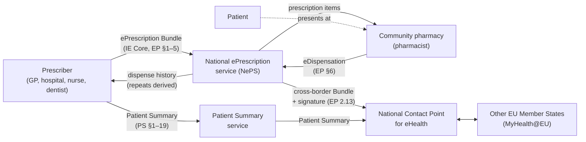
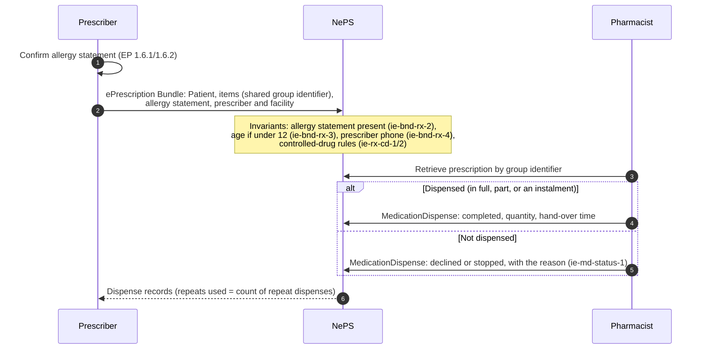
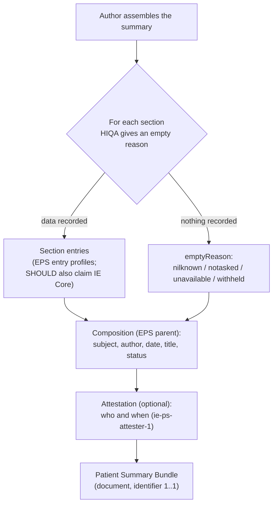

**Based on consultation drafts.** HIQA published two draft national standards for public consultation in
September 2026: *Electronic Prescriptions and Electronic Dispensations* and *Patient Summary*. Both will
change after consultation, and this page will change with them. This IG is a **proof of concept**. It is
not affiliated with, or endorsed by, HIQA, the HSE, HL7 Ireland or the Department of Health.

### What this release does

IE Core 0.2.0 realigns the ePrescription, eDispensation and Patient Summary profiles with the two HIQA
drafts. The work followed four rules:

- **Trace every element.** Each of the 548 HIQA data elements maps to an IE Core element, or is recorded
  as a gap. See [HIQA Traceability](hiqa-traceability.html).
- **Send only the dataset.** An ePrescription carries only the HIQA EP patient dataset. See
  [Data Minimisation](data-minimisation.html).
- **Invent nothing.** Every code was checked on tx.fhir.org. Where HIQA does not settle a question, the IG
  uses a clearly named placeholder and logs it in [Open Issues](open-issues.html).
- **Build on Europe.** The profiles derive from HL7 Europe MPD 1.0.0 (ePrescription) and HL7 Europe
  Patient Summary (EPS), so an Irish prescription or summary is also a valid European one.

### Alignment at a glance

HIQA Mandatory elements. *Aligned* means the element is present, required and MustSupport. *Partial*
means it is present but not yet enforced as HIQA states (the reason is in the traceability notes).

| Standard | HIQA elements | Mandatory aligned | Mandatory partial | Mandatory gap | Prohibited data enforced |
|---|---|---|---|---|---|
| ePrescription / eDispensation | 242 | 40 | 13 | 1 (EP 4.9.1) | 12 |
| Patient Summary | 306 | 46 | 22 | 0 | 3 |
{:.grid}

Most partial items fall into two groups. Some are Mandatory only *within* an optional cluster, such as the
facility address. Others are derived rather than stored, such as the overall prescription status, which
comes from the item statuses (ADR-003).

### How HIQA maps to IE Core

| HIQA | IE Core |
|---|---|
| EP Section 1: Patient | [IE Core Patient (ePrescription)](StructureDefinition-ie-core-patient-eprescription.html): the EP dataset only |
| EP 1.6: Clinical information (allergies, weight, height) | [Allergy statement](StructureDefinition-ie-core-list-allergies-at-prescribing.html) required on every prescription; body weight/height observations |
| EP Section 2: Health practitioner | [Practitioner](StructureDefinition-ie-core-practitioner.html) (IMC, PSI, NMBI, Dental Council), [PractitionerRole](StructureDefinition-ie-core-practitionerrole.html), [Organization](StructureDefinition-ie-core-organization.html) (PSI RPB, GMS Panel), [Location](StructureDefinition-ie-core-location.html) (GLN) |
| EP Sections 3–5: Prescription, medication, dosage | [MedicationRequest (ePrescription)](StructureDefinition-ie-core-medicationrequest-eprescription.html), [Medication](StructureDefinition-ie-core-medication-eprescription.html), grouped in an [ePrescription Bundle](StructureDefinition-ie-core-bundle-eprescription.html) |
| EP 2.13: Signature, cross-border | [Signature Provenance](StructureDefinition-ie-core-provenance-eprescription-signature.html), [cross-border Bundle](StructureDefinition-ie-core-bundle-eprescription-crossborder.html) |
| EP Section 6: Dispensation | [MedicationDispense (eDispensation)](StructureDefinition-ie-core-medicationdispense-edispensation.html) |
| PS Groups 1–3, Sections 1–19 | [Patient Summary Bundle](StructureDefinition-ie-core-bundle-patient-summary.html), [Composition](StructureDefinition-ie-core-composition-patient-summary.html), [Patient (Patient Summary)](StructureDefinition-ie-core-patient-summary-patient.html) |
| Both standards, element by element | Logical models [HIQAEPrescriptionLM](StructureDefinition-HIQAEPrescriptionLM.html) and [HIQAPatientSummaryLM](StructureDefinition-HIQAPatientSummaryLM.html) |
{:.grid}

### System context

The names above describe roles, not real systems. The NePS and the National Contact Point interfaces are
not specified by the HIQA drafts and are out of scope for this IG.

### Prescribe and dispense

### Patient Summary

"Nil known" and "not asked" are different clinical statements, so the IG never lets an empty section go
unexplained (`ie-ps-1`, clinical-safety hazard HZ-03).

### Scenario examples

Eight synthetic scenarios exercise the standards end to end. All people, organisations and identifiers
are fictional.

| # | Scenario | Example |
|---|---|---|
| 1 | Acute adult prescription, dispensed | [Bundle](Bundle-hiqa-bundle-s1-acute-adult.html) · [dispense](MedicationDispense-hiqa-md-s1-amoxicillin.html) |
| 2 | Child under 12: age and weight recorded | [Bundle](Bundle-hiqa-bundle-s2-paediatric.html) |
| 3 | Repeat prescription: part fill, balance, first repeat | [Bundle](Bundle-hiqa-bundle-s3-repeat.html) · dispenses [1](MedicationDispense-hiqa-md-s3-part-fill.html) [2](MedicationDispense-hiqa-md-s3-balance.html) [3](MedicationDispense-hiqa-md-s3-repeat-1.html) |
| 4 | Schedule 2 controlled drug, in instalments | [Bundle](Bundle-hiqa-bundle-s4-controlled-drug.html) · [instalment 1](MedicationDispense-hiqa-md-s4-instalment-1.html) |
| 5 | Not dispensed: the pharmacist declines because of a recorded penicillin allergy | [Bundle](Bundle-hiqa-bundle-s5-non-dispensation.html) · [declined dispense](MedicationDispense-hiqa-md-s5-declined.html) |
| 6 | Cross-border (IE → EU) with the prescriber's signature | [Bundle](Bundle-hiqa-bundle-s6-crossborder.html) |
| 7 | Full Patient Summary | [Bundle](Bundle-hiqa-bundle-s7-patient-summary-full.html) |
| 8 | Patient Summary with empty sections | [Bundle](Bundle-hiqa-bundle-s8-patient-summary-empty.html) |
{:.grid}

### Design decisions

The decisions are recorded as Architecture Decision Records in the
[source repository](https://github.com/hl7-ie/ie-core/tree/main/docs/adr):

| ADR | Decision | Breaking |
|---|---|---|
| 001 | HIQA logical models, generated with their mappings from CSV sources | no |
| 002 | Context-specific patient profiles: the ePrescription patient forbids ethnicity, maiden name, nationality, religion and marital status | **yes** |
| 003 | ePrescription on HL7 Europe MPD 1.0.0; signature as Provenance; cross-border marked by a Bundle profile, not a tag | **yes** |
| 004 | Patient Summary on HL7 Europe EPS | **yes** |
| 005 | R5 track frozen | no |
| 006 | Identifiers without an authoritative source removed; HIQA registration identifiers added | **yes** |
| 007 | Terminology integrity: wrong-meaning, non-existent and inactive codes removed | **yes** |
{:.grid}

### Limitations

- HIQA's drafts do not give FHIR identifier system URIs, OIDs, or codes for the controlled-drug schedule
  and supply legal status. The IG uses clearly named placeholders ([Open Issues](open-issues.html)).
- The SNOMED CT Irish edition and the NMPC are not available on public terminology servers, so their
  ValueSets cannot be checked outside the HSE terminology service (OI-004, OI-018, OI-022).
- Clinical-safety hazards identified during the work, and their mitigations, are logged in
  `docs/hiqa-2026/clinical-safety-log.md` in the source repository.
