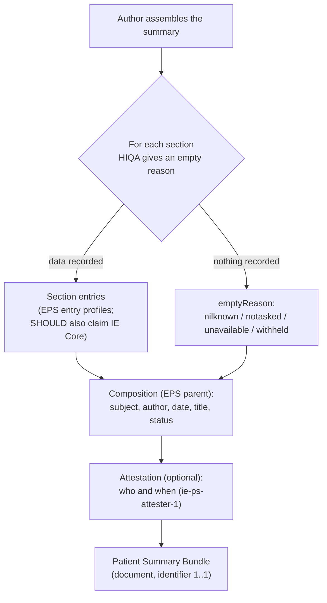

**Based on a consultation draft.** HIQA published the *Draft National Standard for a Patient Summary* for public
consultation in September 2026. It will change after consultation, and this page will change with it. This IG is a
**proof of concept**. It is not affiliated with, or endorsed by, HIQA, the HSE, HL7 Ireland or the Department of Health.

### Scope

IE Core traces the HIQA **Patient Summary** draft. The companion HIQA *Draft National Standard for Electronic
Prescriptions and Electronic Dispensations* is traced in
[IE Medication Events](https://hl7-ie.github.io/medication-events/) (`nostalgic-ie.fhir.medication-events`), which
started as a copy of the IE Core 0.2.0 ePrescription profiles (ADR-009). The Irish identifier systems (IHI, PPSN,
IMC, PSI, ...) stay defined here and are shared by both IGs.

The work follows four rules:

- **Trace every element.** Each of the 306 HIQA Patient Summary data elements maps to an IE Core element, or is
  recorded as a gap. See [HIQA Traceability](hiqa-traceability.html).
- **Send only the dataset.** Each use case carries only its HIQA dataset. See [Data Minimisation](data-minimisation.html).
- **Invent nothing.** Every code was checked on tx.fhir.org or, for NMPC codes, in the NMPC Meds Catalogue. Where
  HIQA does not settle a question, the IG uses a clearly named placeholder and logs it in [Open Issues](open-issues.html).
- **Build on Europe.** The Patient Summary derives from HL7 Europe Patient Summary (EPS), so an Irish summary is also
  a valid European one.

### Alignment at a glance

HIQA Mandatory elements. *Aligned* means the element is present, required and MustSupport. *Partial* means it is
present but not yet enforced as HIQA states (the reason is in the traceability notes).

| Standard | HIQA elements | Mandatory aligned | Mandatory partial | Mandatory gap | Prohibited data enforced |
|---|---|---|---|---|---|
| Patient Summary | 306 | 46 | 22 | 0 | 3 |
{:.grid}

### How HIQA maps to IE Core

| HIQA Patient Summary | IE Core |
|---|---|
| Group 1: Patient, contacts | [IE Core Patient (Patient Summary)](StructureDefinition-ie-core-patient-summary-patient.html), with the nominated contact person |
| Groups 2–3, Sections 1–19 | [Patient Summary Bundle](StructureDefinition-ie-core-bundle-patient-summary.html) and [Composition](StructureDefinition-ie-core-composition-patient-summary.html) |
| Section 5: Allergies and intolerances | [IE Core AllergyIntolerance](StructureDefinition-ie-core-allergyintolerance.html) |
| Section 6: Medication information | [IE Core MedicationStatement](StructureDefinition-ie-core-medicationstatement.html), [IE Core Medication](StructureDefinition-ie-core-medication.html) |
| Element by element | Logical model [HIQAPatientSummaryLM](StructureDefinition-HIQAPatientSummaryLM.html) |
{:.grid}

### Patient Summary

```mermaid
flowchart TD
    A["Author assembles the summary"] --> B{"For each section<br/>HIQA gives an empty reason"}
    B -- "data recorded" --> C["Section entries<br/>(EPS entry profiles;<br/>SHOULD also claim IE Core)"]
    B -- "nothing recorded" --> D["emptyReason:<br/>nilknown / notasked / unavailable / withheld"]
    C --> E["Composition (EPS parent):<br/>subject, author, date, title, status"]
    D --> E
    E --> F["Attestation (optional):<br/>who and when (ie-ps-attester-1)"]
    F --> G["Patient Summary Bundle<br/>(document, identifier 1..1)"]
```

"Nil known" and "not asked" are different clinical statements, so the IG never lets an empty section go
unexplained (`ie-ps-1`, clinical-safety hazard HZ-03).

### Scenario examples

Two synthetic scenarios exercise the standard end to end. All people, organisations and identifiers are fictional.

| # | Scenario | Example |
|---|---|---|
| 7 | Full Patient Summary | [Bundle](Bundle-hiqa-bundle-s7-patient-summary-full.html) |
| 8 | Patient Summary with empty sections | [Bundle](Bundle-hiqa-bundle-s8-patient-summary-empty.html) |
{:.grid}

Scenarios 1–6 (ePrescription and eDispensation) are in IE Medication Events; the numbering is kept so both IGs refer
to the same scenario numbers.

### Design decisions

The decisions are recorded as Architecture Decision Records in the
[source repository](https://github.com/hl7-ie/ie-core/tree/main/docs/adr):

| ADR | Decision | Breaking |
|---|---|---|
| 001 | HIQA logical models, generated with their mappings from CSV sources | no |
| 002 | Context-specific patient profiles (the Patient Summary patient carries the PS dataset) | **yes** |
| 003 | ePrescription on HL7 Europe MPD 1.0.0 (superseded by ADR-009: moved to IE Medication Events) | **yes** |
| 004 | Patient Summary on HL7 Europe EPS | **yes** |
| 005 | R5 track frozen | no |
| 006 | Identifiers without an authoritative source removed; HIQA registration identifiers added | **yes** |
| 007 | Terminology integrity: wrong-meaning, non-existent and inactive codes removed | **yes** |
| 008 | Package id `nostalgic-ie.fhir.core` and Simplifier.net publishing | **yes** |
| 009 | ePrescription and eDispensation moved to IE Medication Events | **yes** |
{:.grid}

### Limitations

- HIQA's draft does not give FHIR identifier system URIs or OIDs. The IG uses clearly named placeholders
  ([Open Issues](open-issues.html)).
- The SNOMED CT Irish Edition and the NMPC are not available on public terminology servers, so their ValueSets
  cannot be checked outside the HSE terminology service (OI-004, OI-018, OI-022).
- Clinical-safety hazards identified during the work, and their mitigations, are logged in
  `docs/hiqa-2026/clinical-safety-log.md` in the source repository.
