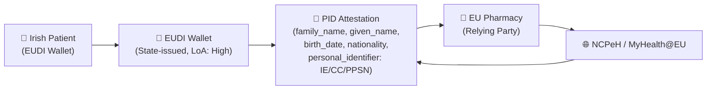

### Security

IE Core implementations **SHALL** address security considerations to protect patient data in accordance with Irish and EU regulations.

### Regulatory Framework

Implementations must comply with:

- **GDPR (General Data Protection Regulation)**: EU Regulation 2016/679 on data protection and privacy
- **Data Protection Act 2018**: Irish implementation of GDPR (S.I. No. 7/2018)
- **Health Act 2007**: Irish legislation governing health information and the HSE
- **eIDAS Regulation 2014/910/EU**: EU regulation on electronic identification and trust services (original)
- **eIDAS 2.0 Regulation 2024/1183/EU**: Amending regulation establishing the European Digital Identity framework (in force May 2024)
- **EHDS Regulation 2025/327**: European Health Data Space regulation (in force March 2025)
- **Health Information and Patient Safety (HIPS) Bill**: Forthcoming Irish legislation for health information governance

For full details of Irish ePrescription and eDispensation legislation, including the Medicinal Products Regulations 2003 (S.I. 540/2003), Health (Pricing and Supply of Medical Goods) Act 2013, and Pharmacy Act 2007, see the [Irish ePrescription Legislation](irish-legislation.html) page.

---

### eIDAS 2.0 and the EU Digital Identity (EUDI) Wallet

#### Overview

[eIDAS 2.0 (Regulation 2024/1183/EU)](https://eur-lex.europa.eu/legal-content/EN/TXT/?uri=CELEX:32024R1183) amends the original eIDAS Regulation and introduces:

- **European Digital Identity (EUDI) Wallets** — mobile/web applications issued by EU Member States that allow citizens to store and present identity attributes and attestations
- **Qualified Electronic Attestations of Attributes (QEAA)** — machine-verifiable digital credentials for identity, qualifications, and other attributes
- **Assurance levels** — Low, Substantial, and High (carried over from eIDAS 2014, clarified in eIDAS 2.0 and Commission Implementing Regulation 2015/1502)
- **Person Identification Data (PID)** — a mandatory set of identity attributes defined in the EUDI Architecture and Reference Framework (ARF) that all EUDI Wallets must support

#### EUDI Wallet in the Healthcare Context (MyHealth@EU / EHDS)

From 2026 (targeted timeline, subject to Member State readiness and Commission decisions), the EUDI Wallet is planned as a primary mechanism for patient identity presentation in cross-border healthcare. The [MyHealth@EU](https://health.ec.europa.eu/ehealth-digital-health-and-care/electronic-cross-border-health-services_en) infrastructure is being updated to accept EUDI Wallet-issued identity attestations at **LoA: High** for cross-border ePrescription and eDispensation.



#### EUDI PID Attribute Set (ARF v2.x)

The EUDI ARF defines the following mandatory PID attributes, which map to FHIR `Patient` and cross-border identifier elements in IE Core:

| EUDI PID Attribute | Description | IE Core FHIR Mapping |
|-------------------|-------------|----------------------|
| `family_name` | Current family name | `Patient.name.family` |
| `given_name` | Current given name(s) | `Patient.name.given` |
| `birth_date` | Date of birth (ISO 8601) | `Patient.birthDate` |
| `age_over_18` | Age attestation boolean | (derived from `Patient.birthDate`) |
| `nationality` / `nationalities` | Nationality (ISO 3166-1 alpha-2) | `Patient.extension[nationality]` (EU Core) |
| `personal_identifier` | Unique persistent identifier | `Patient.identifier` where `system` = cross-border PID system URI |
| `issuing_authority` | Issuing Member State or entity | (metadata on credential, not mapped in FHIR) |
| `issuing_country` | ISO 3166-1 alpha-2 country code | `Patient.identifier.extension[country]` |

The `personal_identifier` maps to the eIDAS cross-border identifier format `Origin/Destination/NationalID` (e.g. `IE/DE/1234567T`). In FHIR, this is represented as:

```json
{
  "use": "official",
  "type": {
    "coding": [{
      "system": "http://terminology.hl7.org/CodeSystem/v2-0203",
      "code": "NI"
    }]
  },
  "system": "urn:oid:1.3.6.1.4.1.12559.11.10.1.3.1.42.1",
  "value": "IE/DE/1234567T"
}
```

The cross-border PID system URI `urn:oid:1.3.6.1.4.1.12559.11.10.1.3.1.42.1` is the eHDSI-defined OID for the eIDAS patient identifier used in MyHealth@EU. For FHIR R4 implementations, this is represented in the `Patient.identifier.system` element.

#### Level of Assurance (LoA) Requirements

| Use Case | Required LoA | Basis |
|----------|-------------|-------|
| Cross-border ePrescription retrieval by patient | **High** | eIDAS 2.0 Article 8; eHDSI Security Policy |
| Cross-border ePrescription retrieval by pharmacist | **Substantial** | eHDSI Security Policy |
| Patient Summary access by patient (self-service) | **High** | eIDAS 2.0; EHDS Regulation 2025/327 |
| Patient Summary access by authorized HCP | **Substantial** | EHDS Regulation 2025/327 |
| National system-to-system (HSE internal) | Application-level (SMART on FHIR) | Irish National Framework |

**LoA: High** requires the use of:
- A EUDI Wallet issued by a recognized Member State (state.ie / identity.ie), or
- A government-issued smart card (e.g. Irish Public Services Card where applicable), or
- Multi-factor authentication with a qualified certificate-backed authenticator

**LoA: Substantial** is met by:
- Online banking-level authentication with multi-factor
- HSE MyHealth/MyGovID at the appropriate level

---

### Qualified Electronic Signatures (QeS) and Seals (QeSeal)

#### Legal Basis

Under eIDAS 2.0 and the original eIDAS Regulation, a **Qualified Electronic Signature (QeS)** has the equivalent legal effect of a handwritten signature across all EU Member States. A **Qualified Electronic Seal (QeSeal)** authenticates the origin of a document by a legal person (e.g. an NCP or healthcare organization).

For cross-border prescription exchange:

- The **Irish NCPeH (HSE)** **SHALL** apply a **Qualified Electronic Seal** to outbound ePrescription bundles before transmission via MyHealth@EU
- The **receiving NCPeH** **SHALL** verify the seal prior to presenting the prescription to the dispensing pharmacy
- **Prescriber digital signatures** within the FHIR Bundle **SHOULD** use a **Qualified Electronic Signature** where required by Irish prescribing regulations

#### Signature Formats

| Format | Use | Specification |
|--------|-----|---------------|
| **XAdES-BES** (XML Advanced Electronic Signature, Basic) | CDA-based prescription documents | ETSI EN 319 132-1 |
| **XAdES-T** (with timestamp) | Long-term validity of prescription | ETSI EN 319 132-1 |
| **JAdES** (JSON Advanced Electronic Signature) | FHIR JSON bundles | ETSI TS 119 182-1 |
| **CAdES** (CMS Advanced Electronic Signature) | Detached signatures for attachments | ETSI EN 319 122-1 |

For FHIR R4 bundles, **JAdES** is the preferred format when applying a qualified seal to a cross-border prescription bundle. The signature is carried in:
- `Bundle.signature` (FHIR standard element) for the bundle-level seal
- `Provenance.signature` for individual prescriber signatures within the bundle

```json
{
  "resourceType": "Bundle",
  "signature": {
    "type": [{ "system": "urn:iso-astm:E1762-95:2013", "code": "1.2.840.10065.1.12.1.7", "display": "Consent Signature" }],
    "when": "2025-01-20T10:30:00Z",
    "who": { "reference": "Practitioner/ie-practitioner-example" },
    "sigFormat": "application/jose",
    "data": "<base64-encoded JAdES signature>"
  }
}
```

#### IHE DSG (Document Digital Signature) Profile

The **IHE Document Digital Signature (DSG)** profile defines how digital signatures are attached to documents in IHE cross-community environments:

| IHE DSG Variant | Use in eHDSI | Notes |
|----------------|-------------|-------|
| DSG Detached | Detached XML signature in XDS/XCA metadata | Used in CDA-based eHDSI transactions |
| DSG Enveloping | Signature wraps the signed content | Used when the entire FHIR Bundle is signed |

References:
- [IHE DSG Profile](https://profiles.ihe.net/ITI/TF/Volume1/ch-37.html)
- [ETSI eSignature Standards](https://www.etsi.org/technologies/electronic-signatures)

#### Irish Qualified Trust Service Providers (QTSPs)

Ireland's QTSPs are listed on the EU Trust Service Status List, maintained by the Department of the Environment, Climate and Communications (DECC):

| QTSP | Services | Relevant For |
|------|----------|-------------|
| **PostSign (An Post)** | Qualified certificates, QeS | Prescriber signing |
| **Eir Trust Services** | SSL/TLS qualified certificates | NCP server certificates |
| **Entrust (Irish operations)** | Qualified certificates for organizations | NCP qualified seal |

The Irish Trust Service List is available at: <https://tlbrowser.tsl.website/?tsl=https://certs.decc.gov.ie/qualified-trust-service-list.xml>

For NCP-to-Hub communication certificates, the **eHDSI Central Connector** requires certificates issued by QTSPs listed on the relevant EU Member State's Trust Service List.

---

### Transport Security

All IE Core API communications **SHALL** use:

- **TLS 1.3** (preferred) or **TLS 1.2** (minimum) for all communications
- **HTTPS** for all FHIR RESTful API endpoints
- Valid server certificates from a Qualified Trust Service Provider (QTSP) for cross-border NCP communications
- Standard certificates from a trusted CA for domestic implementations

#### NCP-to-NCP Certificate Requirements (MyHealth@EU)

For NCPeH-to-NCPeH (NCP-to-Hub) communications via MyHealth@EU:

| Requirement | Specification |
|------------|---------------|
| **mTLS (mutual TLS)** | Both NCP and Hub authenticate each other via client and server certificates |
| **Certificate type** | Qualified certificate for electronic seal (QCSeal) per eIDAS Article 38 |
| **Key algorithm** | RSA 2048-bit minimum; RSA 4096-bit or ECDSA P-256/P-384 recommended |
| **Certificate validity** | Maximum 3 years for NCP server certificates |
| **CRL / OCSP** | Certificate revocation must be checked before each transaction |
| **QTSP requirement** | Certificates must be issued by a QTSP on the EU Trust Service List |

---

### Authentication and Authorization

IE Core implementations **SHOULD** support:

- [SMART on FHIR](http://hl7.org/fhir/smart-app-launch/) for application-level authorization
- OAuth 2.0 with PKCE for public client applications
- OpenID Connect for user authentication
- **FAPI 2.0 (Financial-grade API)** for high-assurance API access, as required by the EHDS Health Data API specification

#### Cross-Border Authentication (MyHealth@EU / EHDS)

For cross-border ePrescription and eDispensation:

| Actor | Authentication Method | LoA |
|-------|----------------------|-----|
| Patient presenting at EU pharmacy | EUDI Wallet (PID attestation) | High |
| Pharmacist accessing NCP | National pharmacy registration + MFA | Substantial |
| NCP-to-NCP (system-to-system) | mTLS with QCSeal certificate | N/A (system) |
| HSE systems to Irish NCP | HSE identity federation + OAuth2 | Substantial |

---

### Access Control

Implementations **SHALL**:

- Implement role-based access control (RBAC) appropriate to the healthcare setting
- Enforce the principle of least privilege
- Support emergency access ("break the glass") procedures with appropriate audit logging
- Restrict access to patient data based on the practitioner's legitimate relationship with the patient

For cross-border scenarios, access control **SHALL** additionally:

- Validate the EUDI Wallet PID attestation signature before granting access
- Verify the patient identifier against the cross-border PID format (`Origin/Destination/NationalID`)
- Apply country-specific access control rules where mandated by the receiving country's NCP

---

### Audit Logging

All access to patient data **SHALL** be logged in accordance with GDPR requirements and the IHE ATNA (Audit Trail and Node Authentication) profile:

- **What** data was accessed
- **Who** accessed the data (user identity, including eIDAS identifier where applicable)
- **When** the access occurred (timestamp, UTC)
- **Why** the access occurred (purpose of use code — from the `PurposeOfUse` vocabulary)
- **How** the data was accessed (application, API endpoint, NCP identifier)

Audit logs **SHOULD** be represented using the [FHIR AuditEvent](http://hl7.org/fhir/R4/auditevent.html) resource.

For cross-border transactions, audit records **SHALL**:

- Include the eIDAS patient identifier used in the transaction
- Record the NCP of origin and NCP of destination
- Be retained in accordance with the eHDSI Audit Trail policy (minimum 3 years)
- Be submitted to the MyHealth@EU Central Audit Service where required

---

### Consent Management

Patient consent for data sharing **SHALL** be:

- Recorded and maintained in accordance with GDPR requirements
- Obtainable and revocable by the patient
- Granular where possible (by data category, recipient, time period)

For cross-border data sharing under EHDS:

- Patient consent for cross-border ePrescription and eDispensation is implied by the patient presenting their EUDI Wallet / eIDAS identity at the dispensing pharmacy, in accordance with the eHDSI consent model
- Explicit opt-in consent is required for secondary use under EHDS Regulation 2025/327
- Consent records **SHOULD** be represented using the FHIR `Consent` resource, with reference to the applicable legal basis

---

### Data Minimization

In accordance with GDPR's data minimization principle:

- Only request the minimum data needed for the intended purpose
- Use SMART on FHIR scopes to limit data access
- Implement server-side filtering to exclude unnecessary data elements
- For cross-border prescriptions, include only the EUDI PID attributes required by the receiving NCP (do not transmit full patient demographics beyond what is needed)

---

### Breach Notification

In the event of a data breach:

- Notify the **Data Protection Commission (DPC)** within 72 hours (GDPR Article 33)
- Notify affected patients without undue delay when the breach is likely to result in a high risk to their rights and freedoms (GDPR Article 34)
- For cross-border breaches involving MyHealth@EU, additionally notify the **eHDSI Incident Management** team and the relevant NCPs
- Document the breach, its effects, and the remedial action taken
